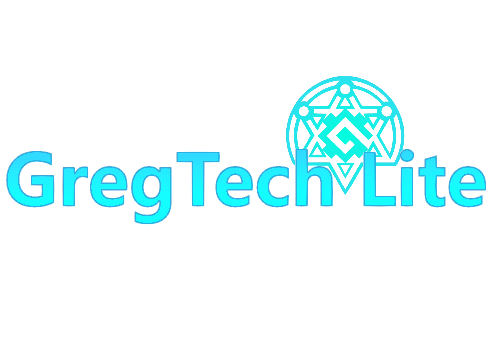

  

<h1 align="center">GregTech Lite Core</h1>

  <i>Core Mod of Minecraft Modpack GregTech Lite</i>

  <i>By Magic_Sweepy</i>

## Welcome to GregTech Lite Core

### What is this?

GregTech Lite Core, a.k.a. _Gregicality Science unofficial Extended Life_, is the core mod for Minecraft 1.12.2 Forge Modpack __[GregTech Lite](https://www.mcmod.cn/modpack/655.html)__. This mod based on **[Gregicality Science](https://github.com/GregTechCEu/gregicality-science)**, and use same mod name.

### Introduction

GTLite core use same Mod Name as [Gregicality Science](https://github.com/GregTechCEu/gregicality-science), but use different Mod ID (means GTLite core is incompability with GCY:S).

#### Features

These are some of the things you will find in this mod:

- Endgame contents from UHV (2,097,105 V) to MAX (2,147,483,647 V), makes the difficulty of GregTech CEu more similar to GregTech 5 Unofficial.

- More Processing machines, e.g. _Mega Machines_, more powerful than Gregicality Multiblocks machines.

- Larger and Stronger Generators, e.g. _Hyper Reactors_, support laser source hatch.

- New Circuits: _Gooware_, _Optical_, _Spintronic_, _Cosmic_, _Supracausal_, _Suprachronal_, _Magneto Resonatic_ and SMDs for Endgame.

- More QoL contents, e.g. more circuit outputs than GregTech CEu.

#### Integrations

- __The One Probe Integration__: Forked from [Gregic Probe](https://github.com/vfyjxf/GregicProbe), add more info of Machines and Multiblocks.

### Project Goal

Improve difficulty and QoL of GregTech CEu, based on GregTech 6, Gregicality Legacy and many related works.

### License

* GregTech Lite Core Template ([TemplateDevEnv](https://github.com/CleanroomMC/TemplateDevEnv))
  - Copyright (c) CleanroomMC
  - 

* GregTech Lite Core API
  - Copyright (c) Magic_Sweepy
  - 

* GregTech Lite Modpack
  - Copyright (c) Magic_Sweepy
  - 

* Texts, Translations and Questbook contents
  - Copyright (c) Magic_Sweepy
  - 

* Textures and Models
  - Copyright (c) Magic_Sweepy and U.M.T
  - 

### Credit Works

* Basic Items, blocks and multiblocks from [Gregicality Science](https://github.com/GregTechCEu/gregicality-science).
* Some textures, multiblocks and processing chains from [Gregicality Legacy](https://github.com/GregTechCEu/gregicality-legacy).
* Some textures, multiblocks and processing chains from [GregTech++](https://github.com/GTNewHorizons/GTplusplus).
* Some textures, multiblocks and processing chains from [GregTech 5 Unofficial](https://github.com/GTNewHorizons/GT5-Unofficial).
* Some textures from [GregTech 6](https://github.com/GregTech6/gregtech6).
* Some texrures and multiblocks from [TecTech](https://github.com/Technus/TecTech).
* Some textures and multiblocks from [GoodGenerator](https://github.com/GTNewHorizons/GoodGenerator).
* Some textures from [Epimorphism](https://gitlab.com/gtcnc/epimorphism-core).
